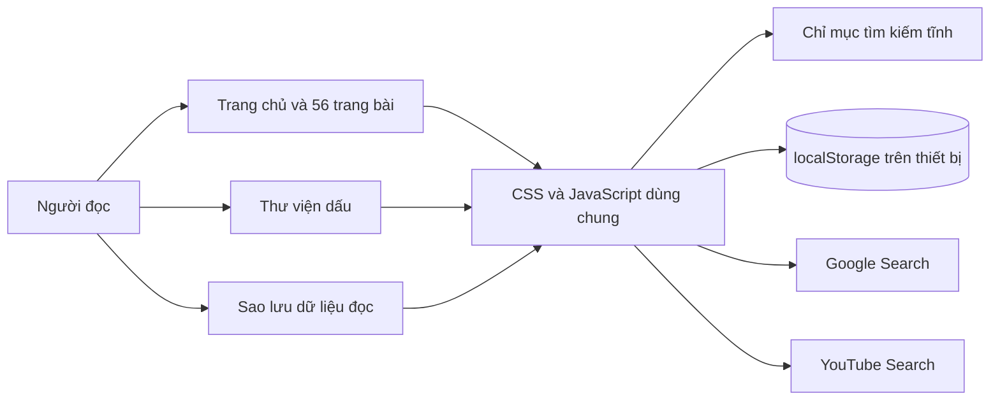
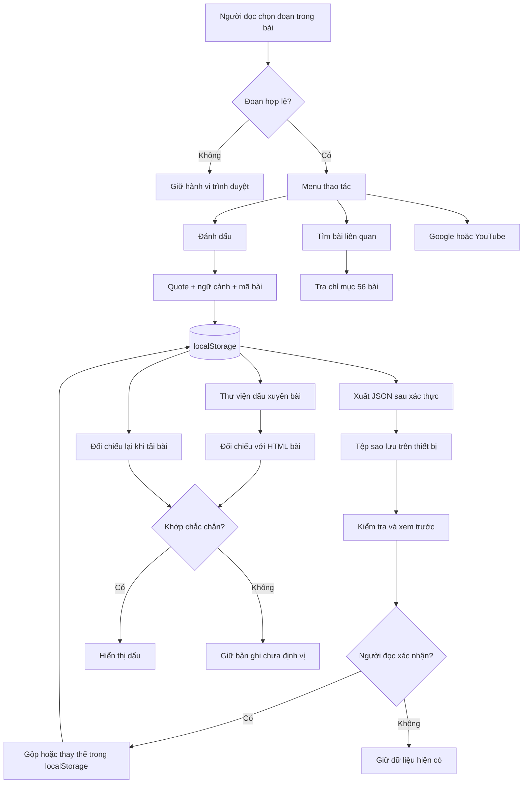
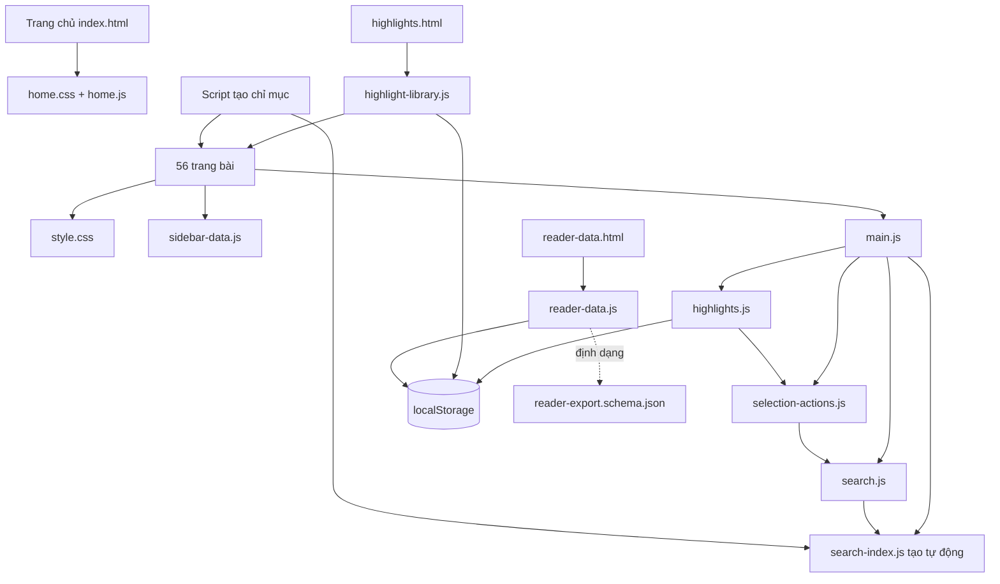
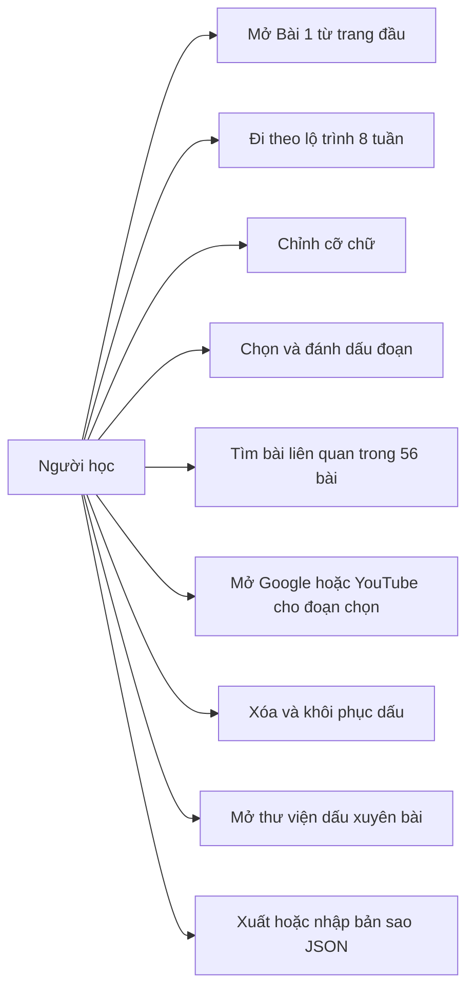

# Kiến trúc nâng cấp website giáo trình

## Tổng quan

Website là tập trang HTML tĩnh. Trang chủ là `index.html`; 56 bài nằm trong `week1/`–`week8/`. Mỗi bài dùng `assets/css/style.css`, `assets/js/main.js` và `assets/js/sidebar-data.js`. Phase 1 đã thêm công cụ đọc/tìm kiếm trong tài nguyên dùng chung.

## DHSYSTEM organization context

Không có `.DHSYSTEM/META.md` hoặc profile tổ chức. Dự án được xử lý như giáo trình cá nhân; thông tin tổ chức không được suy đoán.

## Quyết định công nghệ

| Quyết định | Lý do | Giới hạn |
| --- | --- | --- |
| HTML/CSS/JavaScript thuần | Phù hợp kho mã hiện tại, không cần hạ tầng mới cho các tính năng đã chốt | Cần kỷ luật tách module dùng chung |
| Chỉ mục tìm kiếm tĩnh tạo từ 56 bài | Tìm nội bộ nhanh và nhất quán với nội dung gốc | Cần chạy lại bộ tạo chỉ mục khi biên tập bài |
| `localStorage` cho dữ liệu đọc | Không cần tài khoản để dùng công cụ đọc | Theo origin/thiết bị, có thể bị chặn; cần xuất JSON để có bản sao lưu |
| JSON version 1 để xuất/nhập | Người đọc chủ động chuyển dữ liệu, xem trước xung đột trước khi ghi | Không đồng bộ tự động; rollback nhiều khóa phụ thuộc quyền lưu trữ của trình duyệt |
| Selection/Range + neo bằng đoạn trích/ngữ cảnh | Phục hồi dấu sau khi tải lại, chịu được một phần thay đổi HTML | Không tô nếu quote/ngữ cảnh không khớp chắc chắn |
| Bọc từng text node bằng `<mark>` | Hiển thị nhất quán trên Chromium/WebKit, kể cả chọn xuyên thẻ inline; cho phép focus và cuộn tới dấu | Phải xác thực quote/ngữ cảnh trước mỗi lần tô và tháo mark khi render lại |

## Ranh giới module hiện tại

| Module | Trách nhiệm | Nguồn/đích |
| --- | --- | --- |
| Landing | Giới thiệu, lộ trình, lối vào bài | `index.html`, `assets/css/home.css`, `assets/js/home.js` |
| Lesson shell | Header, menu tuần/bài, vùng đọc | 56 tệp `week*/day*.html` + `sidebar-data.js` |
| Reader settings | Thanh kéo, khôi phục cỡ chữ, chế độ lưu thất bại | `assets/js/main.js` |
| Selection actions | Xác thực đoạn chọn, menu desktop/mobile, URL Google/YouTube | `assets/js/selection-actions.js` |
| Highlights | Tạo/xóa/khôi phục dấu, đối chiếu quote/ngữ cảnh | `assets/js/highlights.js` + `localStorage` |
| Search index | Trích tiêu đề/đề mục/đoạn từ 56 bài | Script tạo chỉ mục, `assets/js/search-index.js` |
| Search UI | Xếp hạng tiêu đề/đề mục/nội dung, từ đồng nghĩa Anh–Việt và đoạn trích khớp | `assets/js/search.js`, `assets/css/search.css` |
| Highlight library | Tìm/lọc dấu xuyên bài, đối chiếu neo với HTML bài, mở/xóa từng dấu | `highlights.html`, `assets/js/highlight-library.js`, `assets/css/highlight-library.css` |
| Reader data | Xuất/nhập JSON, xác thực toàn bộ tệp, xem trước, gộp/thay thế và cố khôi phục khi ghi lỗi | `reader-data.html`, `assets/js/reader-data.js`, `assets/css/reader-data.css`, `.DHSYSTEM/schemas/reader-export.schema.json` |

Chỉ mục `.js` được tạo bằng `tools/build_search_index.py`; sau khi biên tập bài, chạy lại script và xác nhận bằng `--check`. Tính năng lưu trữ được nghiệm thu trên HTTP(S).

## Luồng đọc và tra cứu

1. Mở trang bài → mã chung dựng điều hướng, tải cỡ chữ đã lưu và dấu của bài.
2. Chọn một đoạn trong vùng bài → kiểm tra đoạn chọn, hiển thị công cụ gần đoạn chọn.
3. “Đánh dấu” → lưu `lessonId`, quote, ngữ cảnh và vị trí; render dấu khi có thể xác minh.
4. “Tìm bài liên quan” → tra chỉ mục 56 bài, ưu tiên tiêu đề/đề mục rồi nội dung; kết quả hiển thị ngay trên website.
5. “Tìm giải thích trên Google” hoặc “Tìm video YouTube” → tạo URL truy vấn an toàn và mở tab mới sau thao tác của người dùng.
6. Mở thư viện dấu → đọc bản ghi cục bộ, tải HTML của từng bài có dấu để xác thực neo; dấu còn neo mở bằng `?highlight=<id>`, dấu mất neo chỉ mở đầu bài.
7. Xuất dữ liệu → đọc các khóa `localStorage` của bộ đọc, chuyển cỡ chữ phiên bản cũ nếu cần, xác thực và tải JSON. Nhập dữ liệu → kiểm tra tệp, xem trước số dấu/xung đột, chọn gộp/thay thế rồi mới ghi; khi ghi lỗi thì thử phục hồi các khóa cũ.

## Diagram applicability matrix

| Diagram | Trạng thái | Lý do |
| --- | --- | --- |
| `system-overview` | required | Có ranh giới rõ giữa trang, công cụ đọc, lưu cục bộ và nguồn ngoài |
| `data-flow` | required | Đường đi của đoạn chọn và dấu là trọng tâm tính năng |
| `event-flows` | optional | Luồng sự kiện đã nêu bằng bước; chưa có message broker |
| `module-dependencies` | required | Cần ngăn logic lặp trên 56 trang |
| `deployment` | N/A | Chưa biết dịch vụ hosting; chỉ yêu cầu chạy đúng trên HTTP(S) |
| `user-use-case` | required | Có các hành động người đọc cần nghiệm thu |

## System overview

## Data flow

## Event flows

Không có hàng đợi sự kiện. Sự kiện trình duyệt cần xử lý là `input` của thanh kéo, `selectionchange`/thao tác chọn chữ, `contextmenu` trên desktop, click/chạm vào lệnh, chọn tệp JSON và tải trang. Menu gốc chỉ bị thay thế khi có Selection hợp lệ trong vùng bài; có lối thao tác tương đương bằng bàn phím. Cần kiểm thử khác biệt trình duyệt, đặc biệt `contextmenu`.

## Module dependencies

## Deployment

N/A cho sơ đồ triển khai: kho mã chưa ghi dịch vụ hosting hoặc CI. Khi triển khai, phục vụ toàn bộ website qua HTTP(S) cùng origin, kiểm tra đường dẫn tương đối và `localStorage`; không dựa vào hành vi `file:`.

## User use case

## UI Direction đã đọc

- `.DHSYSTEM/ui-direction/2026-10-02/index.html`: hub hai màn hình mẫu.
- `pages/home.html`: trang đầu giới thiệu gọn, một hành động chính và lộ trình 8 tuần.
- `pages/reader.html`: bố cục bài, thanh kéo cỡ chữ; lệnh chọn chữ là minh họa giao diện.
- `style.css`, `notes.md`, `design.md`: quy tắc chữ, màu, lưới và mobile. Pages inventory khớp cả hai trang trong `pages/`.

## Rủi ro và xử lý

- **Bài HTML có cấu trúc không đồng đều:** rà mẫu bài đầu, giữa, cuối; công cụ chọn chữ chỉ hoạt động trong vùng xác định, không dựa vào vị trí DOM cứng.
- **Quote trùng hoặc bài được sửa:** dùng ngữ cảnh hai phía và vị trí gợi ý; không khớp chắc chắn thì không tô.
- **Tô chữ làm thay đổi DOM:** bọc các text node trong `<mark>` sau khi xác thực neo; khi render lại phải tháo mark cũ để không lồng thẻ hoặc làm lệch offset.
- **Lưu trữ bị chặn:** đọc trang và công cụ tìm kiếm vẫn hoạt động; báo rõ dấu/cỡ chữ không được lưu.
- **Mobile tràn ngang:** sửa phần tử gây tràn, không che nội dung; kiểm tra bảng và sơ đồ ở 320 px.

## Nguồn chính thức đã tham khảo

- [MDN responsive design](https://developer.mozilla.org/en-US/docs/Learn_web_development/Core/CSS_layout/Responsive_Design)
- [W3C WCAG 2.2](https://www.w3.org/TR/wcag/)
- [MDN range input](https://developer.mozilla.org/en-US/docs/Web/HTML/Reference/Elements/input/range)
- [MDN localStorage](https://developer.mozilla.org/en-US/docs/Web/API/Window/localStorage)
- [MDN contextmenu event](https://developer.mozilla.org/en-US/docs/Web/API/Element/contextmenu_event)

## Kiến trúc hình minh họa (Phase 4–6)

Hình tĩnh đặt dưới `assets/images/lessons/`; ảnh raster dùng WebP, sơ đồ tự vẽ dùng SVG. `assets/images/lessons/SOURCES.md` giữ xuất xứ theo từng tệp, giấy phép, ngày kiểm tra, biến đổi và bài dùng. Mỗi HTML bài tham chiếu tài sản cục bộ với alt text và chú thích. `docs/visuals/overview-specs.json` chứa 56 sơ đồ riêng; `tools/render_lesson_visuals.py` dựng SVG, còn `tools/integrate_lesson_visuals.py` chèn hình vào bài. `docs/visuals/summary-specs.json` chứa 12 sơ đồ tổng hợp; `tools/build_summary_visuals.py` dựng SVG và chèn hình cùng bản diễn giải chữ vào cuối các bài ôn tập/đồ án. `tools/import_public_photos.py` kiểm tra giấy phép từng tệp Commons trước khi nhập WebP. `tools/check_visuals.py --require-all` kiểm tra độ phủ, liên kết hình và nguồn; `tools/qa_lesson_visuals.py` và `tools/qa_summary_visuals.py` kiểm tra 320/390/1280 px; `tools/qa_browser.py` kiểm tra luồng đọc mobile. Khi sửa HTML bài, chạy lại `tools/build_search_index.py`. Không thêm dịch vụ hoặc quyền truy cập mạng lúc người đọc mở trang.
