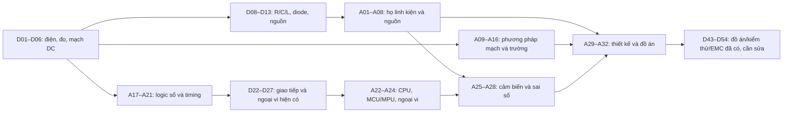

# Đề cương học tập — bản triển khai P7-01

Ngày kiểm kê: 2026-10-03. Nguồn hiện trạng là 56 trang `week1/day01.html` đến `week8/day56.html`; từng mục tiêu, đề mục và vị trí nằm trong [`coverage-matrix.csv`](coverage-matrix.csv). Đây là baseline để triển khai Phase 7–10 theo `.DHSYSTEM/CURRICULUM-PLAN.md`, không phải xác nhận rằng người học đã đạt năng lực nêu trên trang.

## Phạm vi và người học

- Giữ nguyên 56 URL hiện hành làm tuyến nhập môn, sửa lỗi nội dung và sơ đồ tại URL cũ. Thêm 32 bài `advanced/a01.html`–`advanced/a32.html` theo bốn nhóm dưới đây. Đây là **giả định tác nghiệp từ kế hoạch đã được yêu cầu triển khai**, vì người dùng chưa trả lời câu hỏi trước đó về số bài và đối tượng chính; nếu phạm vi đổi, sửa đề cương và ma trận trước khi xuất bài mới.
- Độc giả mặc định: người mới học điện tử, có thể đọc số thập phân, tỉ lệ, đồ thị và đại số cơ bản, hướng tới làm mạch thực và firmware. Bài nâng cao giữ một nhánh trực quan và một nhánh toán có tiên quyết ghi rõ.
- M0: đơn vị, tiền tố, đại số một ẩn, tỉ lệ, lũy thừa. M1: phương trình tuyến tính nhiều ẩn, đồ thị hàm mũ và lượng giác cơ bản. M2 (nhánh toán): đạo hàm/tích phân, phương trình vi phân và số phức. Không ngầm coi M2 là kiến thức đầu vào của người mới.
- Không biết board, nguồn lab, đồng hồ, oscilloscope hay ngân sách người học. Bài lý thuyết có ví dụ độc lập board và nhánh mô phỏng có thể lặp lại. Bài cần chân/nguồn cụ thể phải khóa mã board, revision, module và tài liệu hãng trước khi chỉ dẫn lắp. ESP32 trong các bài cũ là ví dụ hiện hữu, chưa là board bắt buộc cho 32 bài mới.
- Thực hành cho người mới dùng nguồn thấp áp cách ly. Mạch pin, sạc, motor, relay và nguồn chuyển mạch cần rà thông số part/module và duyệt chuyên môn trước khi đưa thành hướng dẫn phần cứng; mô phỏng không chứng minh an toàn của mạch thật.

## Đường học và đồ thị tiên quyết

`Dnn` chỉ bài cũ, `Ann` chỉ bài mới. Tiên quyết từng Dnn là **suy luận biên tập** ghi ở CSV, chưa được giáo viên duyệt. Bài tổng kết có thể học theo thứ tự tuần, nhưng các bài nền A17–A21 nên được học **trước khi quay lại D22–D27** nếu người học chưa biết logic số; điều này không đổi URL cũ.

Đường học ngắn cho người mới: D01–D06 → D08–D13 → A01–A08 → A09–A13 → A17–A21 → D22–D27 → A22–A28 → A29–A32. D07, D14 và các bài ôn tuần là điểm kiểm tra; D15–D21, D29–D42 và D43–D54 ghép vào sau tiên quyết tương ứng. A14–A16 có thể học sau A13 và trước A29; nhánh M2 là tùy chọn.

## A01–A32: mục tiêu và đầu ra dự kiến

Mỗi bài cần mục tiêu đo được, ví dụ có lời giải, sơ đồ/đồ thị có nguồn chỉnh sửa được, một phép đo hoặc mô phỏng có dữ liệu kỳ vọng, bài tập tự kiểm và giới hạn mô hình. Mã dưới đây là mã triển khai, không phải bằng chứng bài đã tồn tại.

| Bài | Tiên quyết | Mức toán | Mục tiêu học và đầu ra tối thiểu | Tránh lặp/chỗ nối bài cũ |
| --- | --- | --- | --- | --- |
| A01 — Họ điện trở cố định | D02,D03 | M0 | Nhận dạng carbon/metal film, wirewound, thick/thin-film, SMD, shunt; chọn giá trị, dung sai, công suất và package từ yêu cầu. | D03 đã dạy mã màu, SMD và sai số; mở rộng đặc tính/chọn, không dạy lại toàn bài. |
| A02 — Điện trở chức năng và phép đo | A01,D06 | M0 | Phân biệt biến trở, NTC/PTC, LDR, shunt và phần tử phi tuyến; lập bảng phép đo và điều kiện nhiệt/ánh sáng. | NTC/LDR có trong D06,D25,D21 nhưng chưa thành bản đồ lựa chọn. |
| A03 — Các họ tụ điện | D08 | M0 | Nhận dạng ceramic, film, điện phân, polymer và supercap; xác định cực tính, điện áp định mức, dung sai và ứng dụng. | D08 đã có phân loại và phép đo đầu tiên. |
| A04 — Tụ trong mạch thực | A03,D09 | M1 | So sánh ESR, leakage, derating, đáp ứng tần số; chọn tụ nguồn/lọc với phép tính và số liệu datasheet. | Nối RC của D09 và decoupling D54. |
| A05 — Các họ diode | D04,D11,D12 | M0–M1 | Phân biệt chỉnh lưu, switching, Schottky, Zener, TVS, LED và quang diode; chọn theo điện áp, dòng, nhiệt và thời gian phục hồi khi liên quan. | D11,D12 đã giới thiệu một số loại. |
| A06 — Cuộn cảm và phần tử từ | D10,D32 | M1 | Đọc L, DCR, dòng bão hòa và lõi; phân biệt choke/ferrite bead/biến áp; kiểm điện áp khi ngắt tải cảm. | D10 có mô hình RL và phân loại mở đầu. |
| A07 — Adapter, nguồn và pin | D13,D41 | M1 | Phân biệt nguồn ngoài, linear/switching, pin và khối bảo vệ; lập ngân sách điện áp/dòng/tổn hao ở nguồn thấp áp. | D13,D41,D32 có từng thiết bị; phần pin cần cổng duyệt riêng. |
| A08 — Chọn linh kiện bằng datasheet | A01,A03,A05,A06,A07 | M1 | Lập bảng yêu cầu → part/package/revision → giới hạn → BOM; giải thích vì sao một part bị loại. | Tổng hợp các ví dụ chọn rời rạc trong D03,D08,D11,D13. |
| A09 — Mô hình và KCL/KVL | D05,D06 | M1 | Chọn mốc, dấu điện áp/dòng, giải và kiểm công suất một mạch DC nhiều nhánh. | D06 đã giới thiệu luật nhưng chưa thành quy trình giải tổng quát. |
| A10 — Phương pháp nút/vòng | A09 | M1 | Viết hệ phương trình nút và vòng cho cùng mạch, so nghiệm, nhận biết supernode/supermesh ở ví dụ phù hợp. | Nâng độ sâu D05,D06. |
| A11 — Chồng chất và nguồn phụ thuộc | A10 | M1 | Giải mạch tuyến tính bằng chồng chất, chỉ rõ quy tắc xử lý nguồn phụ thuộc và miền áp dụng. | Không thấy đề mục chuyên biệt trong 56 bài; cần kiểm toàn văn khi viết. |
| A12 — Thévenin/Norton | A09,A10 | M1 | Tìm nguồn tương đương tại hai cực, kiểm tải khác nhau và công suất tải. | Chưa có đề mục độc lập trong 56 bài; liên hệ D17,D20. |
| A13 — Quá độ RC/RL | A09,D09,D10 | M1; M2 tùy chọn | Đặt điều kiện đầu, hằng số thời gian, tính/đo/mô phỏng quá độ, nêu giả định linh kiện lý tưởng. | D09,D10 đã có τ; tăng chiều sâu bài giải. |
| A14 — RLC, AC và trở kháng | A13,D31 | M1 trực quan; M2 nhánh phasor | So sánh biên độ/pha/cộng hưởng/băng thông bằng đồ thị và mô phỏng; nhánh toán dùng số phức. | D31 có bộ lọc nhưng chưa tuyến RLC đầy đủ. |
| A15 — Điện trường đến điện dung | A03,A09 | M1 trực quan; M2 tùy chọn | Liên hệ điện thế, trường, điện môi, điện dung với tụ thật và một phép đo/sim; nêu giới hạn mô hình bản cực. | D08 chỉ giới thiệu điện trường trong tụ. |
| A16 — Từ trường, cảm ứng và đường hồi dòng | A06,A15,D54 | M1 trực quan; M2 tùy chọn | Liên hệ cuộn cảm, cảm ứng, nhiễu và PCB; vẽ đường dòng đi/về của một mạch thấp áp. | D10,D54 chạm tới từ trường/return path. |
| A17 — Nhị phân và mức logic | D01,D06 | M0 | Đổi cơ số, phân biệt mức 0/1 với điện áp thật, đọc ngưỡng/biên nhiễu từ datasheet part cụ thể. | Là nền bổ sung trước D22–D27. |
| A18 — Boolean và cổng logic | A17 | M0 | Lập bảng chân trị, đơn giản hóa biểu thức nhỏ, vẽ mạch AND/OR/NOT/NAND/NOR. | Chưa có tuyến cổng logic trong đề mục 56 bài. |
| A19 — Mạch tổ hợp | A18 | M0–M1 | Thiết kế mux/decoder/adder nhỏ từ bảng chân trị và kiểm mọi tổ hợp đầu vào. | Là cầu nối tới bus và ADC/DAC. |
| A20 — Chốt, flip-flop, bộ đếm | A19 | M0–M1 | Vẽ waveform trạng thái theo cạnh clock, phân biệt latch/flip-flop, xây bộ đếm nhỏ. | D44 có state machine firmware nhưng chưa nền phần cứng tuần tự. |
| A21 — FSM, clock và timing | A20 | M1 | Lập state diagram/bảng chuyển, kiểm setup/hold và xử lý input bất đồng bộ ở mức khái niệm/lab. | Nối D19 PWM, D26 interrupt, D44 state machine. |
| A22 — CPU, bộ nhớ, bus, MCU/MPU/SoC | A17,A21,D22 | M0–M1 | Vẽ sơ đồ khối hệ xử lý, phân biệt các loại chip theo chức năng và tài nguyên, giải thích luồng lệnh/dữ liệu. | D37,D52 dùng ESP32/CPU nhưng chưa dạy kiến trúc thành chương. |
| A23 — Ngoại vi MCU và thời gian thực | A22,D25,D26 | M1 | Giải thích GPIO, timer, ADC, DMA, ngắt và bộ nhớ; làm lab một ngoại vi với tín hiệu đo kỳ vọng. | D25,D26 đã dạy ADC/ngắt; bổ sung kiến trúc và phép kiểm. |
| A24 — So sánh board/part hiện đại | A22,A23 | M1 | So một bài toán trên ít nhất hai họ board bằng tài liệu hãng đúng model/revision; chốt một cấu hình lab khi có thiết bị. | Không suy pinout/điện áp module từ tên họ chip. |
| A25 — Bản đồ cảm biến | A08,D27,D40 | M0–M1 | Lập ma trận theo đại lượng, nguyên lý, dạng output, dải, nguồn, sai số và cách nhận diện. | D27,D40 là một vài module riêng lẻ. |
| A26 — Nhiệt, ánh sáng, từ | A25 | M1 | So ít nhất hai công nghệ cho mỗi tình huống đã chọn; đọc part marking/pinout và thiết kế phép đo. | Nối NTC/LDR hiện có, mở Hall/thermocouple khi nguồn phù hợp. |
| A27 — Áp suất, chuyển động, khoảng cách | A25 | M1 | So cảm biến áp suất, IMU/PIR và IR/siêu âm; chọn theo dải, môi trường và nguồn. | Nối D27,D40,D42. |
| A28 — Sai số, hiệu chuẩn, lọc và giao tiếp cảm biến | A25,A26,A27,D25 | M1 | Tính ngân sách sai số đơn giản, thu dữ liệu chuẩn, hiệu chuẩn một kênh và báo cáo trước/sau. | D47 có ví dụ offset nhưng chưa phương pháp chung. |
| A29 — Từ yêu cầu tới schematic | A08,A12,A16,A21,A28 | M1 | Viết yêu cầu định lượng, sơ đồ khối, net và test point; lập bảng rủi ro và kế hoạch kiểm. | D43,D44 đã có SRS/schematic ở mức đồ án. |
| A30 — Thiết kế nguồn thấp áp | A07,A12,A29 | M1 | Tính worst-case nguồn/tải/nhiệt/dung sai; schematic, BOM, mô phỏng và test plan cho nguồn cách ly thấp áp. | Nối D13,D32,D35; reviewer kiểm mạch thật trước lắp. |
| A31 — Cảm biến + MCU + PCB | A23,A28,A29,A30,D33 | M1 | Chọn part/board cụ thể, vẽ schematic và PCB, chạy ERC/DRC, đo điểm kiểm và lưu sai khác. | Nối D33,D46; không coi ERC/DRC là chứng minh chức năng. |
| A32 — Đồ án tích hợp và báo cáo | A31 | M1 | Giao yêu cầu, sơ đồ, BOM, firmware, phép đo, sai số, lỗi và cải tiến với rubric kiểm độc lập. | Nối D42–D50; cần ghi rõ phần chỉ mô phỏng/chưa đo thật. |

## Cổng biên tập cho từng bài

1. Phân biệt trạng thái `đã có`, `chỉ giới thiệu`, `cần mở rộng` và `chưa xác nhận` bằng mục tiêu, đề mục, bài tập và nội dung/nguồn; sự có mặt của một từ khóa không đủ để chấm năng lực.
2. Bản nguồn sơ đồ điện chỉnh sửa được, SVG hiển thị, mô tả chữ nêu net/cực tính/điều kiện; kiểm độ rõ ở màn 320 px và chữ lớn. Sơ đồ cấp nguồn/relay/motor/pin cần duyệt chuyên môn riêng.
3. Nêu part number/package/revision, giới hạn điện áp/dòng/nhiệt và nguồn theo từng claim kỹ thuật. Với module, datasheet IC không tự chứng minh pinout của module.
4. Bài tập có đáp án và bước giải, mô phỏng/đo có dữ liệu kỳ vọng, sai khác được giải thích. Nêu thẳng khi chưa có phần cứng để kiểm.
5. Sau mỗi Phase kiểm ma trận, mục lục, tìm kiếm, link và mobile; `dh-audit` rồi `dh-debug` cho lỗi xác nhận trước khi chuyển Phase.
